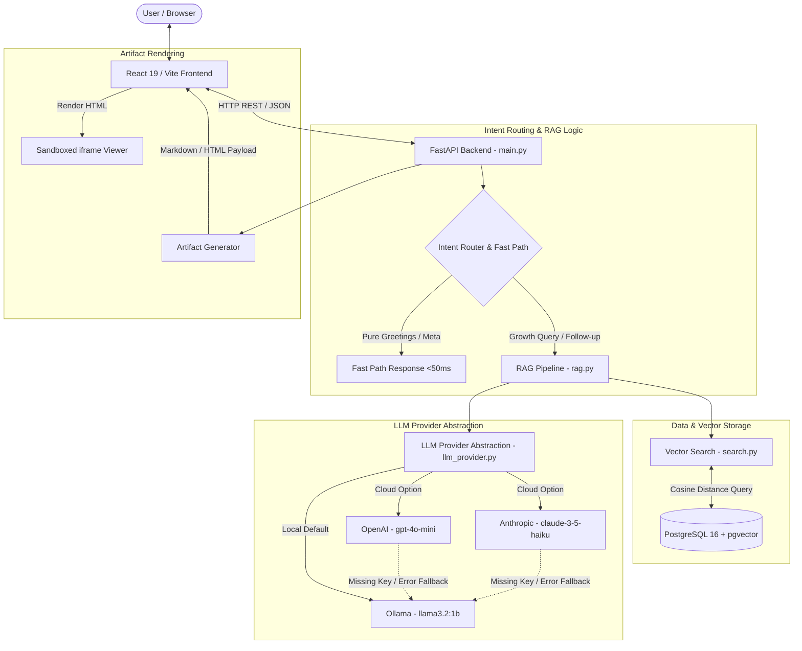
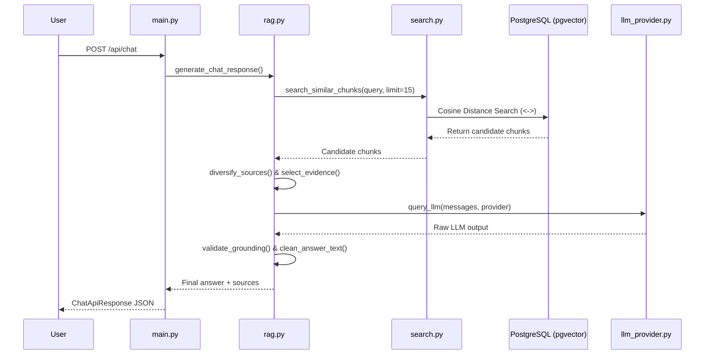

# Architecture — Lenny Growth Assistant

## 1. Architecture Overview

The **Lenny Growth Assistant** is a full-stack, AI-powered product and growth intelligence application. It combines a modern React frontend with a FastAPI backend, a PostgreSQL + `pgvector` database, a Retrieval-Augmented Generation (RAG) engine, and a flexible LLM provider abstraction supporting local Ollama models alongside cloud providers (OpenAI, Anthropic).



---

## 2. System Components

### Backend Modules (`backend/`)

- **`main.py`**: Entry point for the FastAPI web server. Defines Pydantic request/response schemas (`ChatApiRequest`, `ChatApiResponse`, `ArtifactApiRequest`, `ArtifactApiResponse`), configures CORS, exposes REST endpoints (`/`, `/health`, `/api/chat`, `/api/artifacts`), manages database transactions, and sanitizes outgoing chat preambles.
- **`database.py`**: Configures SQLAlchemy engine and session factory (`SessionLocal`) connecting to PostgreSQL using the `DATABASE_URL` environment variable.
- **`models.py`**: Defines database schemas using SQLAlchemy ORM:
  - `TranscriptChunk`: Stores transcript segments, metadata (episode, title, url, chunk_index), and 768-dimensional `pgvector` embeddings.
  - `ChatSession`: Represents distinct user conversation sessions.
  - `ChatMessage`: Stores conversation message history (role, content, timestamp) linked to a `ChatSession`.
- **`loader.py`**: Ingests raw JSON transcript files from `data/transcripts/`, parsing metadata (guest, episode title, source URL) and raw text.
- **`chunker.py`**: Splits transcript text into overlapping chunks (~1000 characters with ~200 character overlap) to preserve semantic context across chunk boundaries.
- **`embedder.py`**: Generates 768-dimensional vector embeddings for text chunks using the local Ollama `nomic-embed-text` API endpoint.
- **`search.py`**: Executes vector similarity searches against PostgreSQL using `pgvector` cosine distance (`<->` operator) to retrieve top candidate chunks matching a user query vector.
- **`rag.py`**: Core intelligence pipeline containing:
  - **Fast-path detection**: `is_pure_greeting()` and `is_capability_question()`.
  - **Query analysis**: `analyze_query()` extracts target experts and topic keywords.
  - **Evidence selection & diversification**: `select_evidence()` and `diversify_sources()` cap repeated episodes to ensure multi-expert representation.
  - **Prompt construction**: Assembles system instructions, session history, and transcript evidence.
  - **Grounding validation**: `validate_grounding()` verifies expert attribution, token overlap, and sentence completeness.
  - **Artifact generation**: `generate_artifact()` constructs structured Markdown and HTML documents.
- **`llm_provider.py`**: Provider abstraction routing text generation to Ollama (`llama3.2:1b`), OpenAI (`gpt-4o-mini`), or Anthropic (`claude-3-5-haiku`). Handles cloud API key checking and automatic fallback to Ollama.
- **`skills/ship30.py`**: Encodes Ship30 "30-for-30" writing principles (strong hooks, narrative progression, skimmability, specificity, grounded claims, 1000–1400 target word counts).
- **`agent_tools.py`**: Optional agent tooling helpers for structured execution.

### Frontend Components (`frontend/src/`)

- **`App.jsx`**: Main single-page React application managing session selection, message state, provider toggling, chat streaming UI, formatted text rendering (`FormattedText`), and the split-screen **Artifact Viewer** panel.

---

## 3. Request Lifecycle

The complete lifecycle of a standard chat request follows these steps:

1. **User Input**: User submits a message via the chat input form in `App.jsx`.
2. **Frontend Dispatch**: React sends an HTTP `POST` request to `http://localhost:8000/api/chat` containing `{ session_id, message, provider }`.
3. **FastAPI Processing**: `main.py` validates request payload using Pydantic `ChatApiRequest`.
4. **Session History Lookup**: `main.py` queries `chat_sessions` and `chat_messages` in PostgreSQL to retrieve previous conversation turns for the given `session_id`.
5. **User Message Persistence**: The new user message is saved to `chat_messages`.
6. **Intent Routing**: `rag.py` inspects the message:
   - If pure greeting $\rightarrow$ returns instant greeting (<50ms).
   - If capability query $\rightarrow$ returns instant overview (<50ms).
   - Otherwise $\rightarrow$ proceeds to RAG.
7. **Semantic Retrieval**: Query embedding generated via `nomic-embed-text`; `search.py` retrieves top candidates from PostgreSQL using `pgvector`.
8. **Evidence Selection & Diversification**: `diversify_sources()` caps max chunks per episode to select up to 3 diverse expert chunks.
9. **Prompt Construction**: `rag.py` builds the LLM prompt incorporating system rules, retrieved evidence, and recent conversation turns.
10. **LLM Execution & Fallback**: `llm_provider.py` queries the selected provider (Ollama / OpenAI / Anthropic). If a cloud provider fails or lacks an API key, it falls back to Ollama.
11. **Grounding Validation & Sanitization**: Output is validated by `validate_grounding()` for expert attribution and token overlap, stripped of preambles by `sanitize_chat_answer()`, and truncated fragments are cleaned.
12. **Response Persistence & Delivery**: Assistant message is saved to PostgreSQL `chat_messages`, and FastAPI returns JSON payload containing `{ session_id, message, sources, provider }`. Frontend renders response and source attribution cards.

---

## 4. Hybrid Assistant / Intent Routing

The system uses deterministic intent routing before executing vector search or LLM generation:

```text
Incoming Query
     │
     ├──> Pure Greeting Check (is_pure_greeting) ───────> Return Fast Greeting (<50ms, No RAG)
     │
     ├──> Capability Check (is_capability_question) ───> Return Fast Capabilities (<50ms, No RAG)
     │
     └──> Lenny Growth Query / Follow-up ────────────────> Execute Semantic Retrieval & RAG
```

- **Greeting Fast Path**: Queries like `"hi"`, `"hello"`, or `"good morning"` return `GREETING_RESPONSE` immediately with 0 sources.
- **Capability Fast Path**: Queries like `"what can you do?"` or `"what features do you have?"` return `CAPABILITY_RESPONSE` immediately with 0 sources.
- **RAG Execution**: All other queries execute vector retrieval and evidence selection.
- **Follow-Up Context Handling**: Recent conversation history (up to 6 turns) is passed to the prompt to resolve pronouns (*"this"*, *"that"*, *"he"*, *"she"*), but previous assistant answers are strictly prohibited from acting as factual evidence.

---

## 5. Knowledge Base and Ingestion Pipeline

```text
Lenny Transcripts (JSON) ──> loader.py ──> chunker.py ──> embedder.py (nomic-embed-text) ──> PostgreSQL (pgvector)
```

- **Transcript Source**: JSON transcript files residing in `data/transcripts/`.
- **Chunking Configuration**: Text is split using `chunker.py` into ~1000-character segments with ~200-character overlaps.
- **Embedding Model**: `nomic-embed-text` via local Ollama API.
- **Dimensionality**: 768-dimensional float vectors.
- **Vector Storage**: Stored in `transcript_chunks.embedding` column with PostgreSQL `pgvector` indexing.
- **Rebuilding Knowledge Base**: Run `python backend/loader.py` to parse transcript files, compute embeddings, and insert records into PostgreSQL.

---

## 6. Retrieval and RAG Pipeline



### Key RAG Operations:
- **Query Vectorization**: Generates embedding for user prompt.
- **Cosine Distance Search**: Executes `ORDER BY embedding <-> query_vector LIMIT 15`.
- **Source Diversification**: `diversify_sources()` caps max chunks per episode to 1, selecting up to 3 distinct experts.
- **Focused Context**: Formats evidence into explicit `SOURCE 1`, `SOURCE 2` blocks.
- **Grounding Validation**: Rejects ungrounded claims, ensuring token overlap between answer and evidence.

---

## 7. Database Architecture

The application uses PostgreSQL 16 with the `pgvector` extension.

```sql
CREATE EXTENSION IF NOT EXISTS vector;

-- Transcript Chunks Schema
CREATE TABLE transcript_chunks (
    id SERIAL PRIMARY KEY,
    episode VARCHAR(255),
    title VARCHAR(255),
    source_url TEXT,
    timestamp VARCHAR(50),
    chunk_index INTEGER,
    content TEXT,
    embedding VECTOR(768),
    created_at TIMESTAMP DEFAULT CURRENT_TIMESTAMP
);

-- Chat Sessions Schema
CREATE TABLE chat_sessions (
    id SERIAL PRIMARY KEY,
    session_id VARCHAR(255) UNIQUE NOT NULL,
    created_at TIMESTAMP DEFAULT CURRENT_TIMESTAMP,
    updated_at TIMESTAMP DEFAULT CURRENT_TIMESTAMP
);

-- Chat Messages Schema
CREATE TABLE chat_messages (
    id SERIAL PRIMARY KEY,
    session_id INTEGER REFERENCES chat_sessions(id) ON DELETE CASCADE,
    role VARCHAR(50) NOT NULL,
    content TEXT NOT NULL,
    created_at TIMESTAMP DEFAULT CURRENT_TIMESTAMP
);
```

---

## 8. LLM Provider Architecture

The provider abstraction [`llm_provider.py`](file:///c:/Users/bhara/Desktop/OOg/lenny-growth-assistant/backend/llm_provider.py) isolates model invocation logic from application code:

- **Ollama (Local / Default)**:
  - Model: `llama3.2:1b`
  - Options: `num_predict=96`, `temperature=0.1`, `num_ctx=4096`, `keep_alive="5m"`.
- **OpenAI (Cloud)**:
  - Model: `gpt-4o-mini`
  - Requires `OPENAI_API_KEY`.
- **Anthropic (Cloud)**:
  - Model: `claude-3-5-haiku-20241022`
  - Requires `ANTHROPIC_API_KEY`.

### Provider Switching & Fallback Logic

```text
Selected Provider
       │
       ├──> Ollama ───────> Query Local Ollama (llama3.2:1b)
       │
       ├──> OpenAI ───────> Check OPENAI_API_KEY
       │                          ├── Valid   ──> Query OpenAI API
       │                          └── Missing ──> Log Warning & Fallback to Ollama
       │
       └──> Anthropic ────> Check ANTHROPIC_API_KEY
                                  ├── Valid   ──> Query Anthropic API
                                  └── Missing ──> Log Warning & Fallback to Ollama
```

---

## 9. Session and Conversation Context

- **Session Identification**: Every chat session is tracked via a unique `session_id`.
- **Message History**: Previous message turns are loaded from PostgreSQL `chat_messages` and passed into prompt context (up to 6 turns).
- **Session Isolation**: New session IDs query empty history, guaranteeing complete privacy between separate user chats.
- **Evidence Ground-Truth Principle**: Conversation history is strictly restricted to resolving anaphoric references. The LLM is instructed: *"NEVER reuse, repeat, or treat previous assistant answers as factual evidence."*

---

## 10. Artifact Generation Architecture

Artifacts are generated via `POST /api/artifacts`:

```text
Artifact Request ──> generate_artifact() ──> Code Fence Stripping / Heading Unescaping ──> Sandboxed Viewer Panel
```

- **Supported Formats**: `markdown` and `html`.
- **Code-Fence Handling**: `generate_artifact()` strips leading/trailing markdown triple-backtick fences (` ```markdown ` or ` ```html `).
- **Heading Normalization**: Automatically unescapes backslash-escaped headings (e.g., `\##` $\rightarrow$ `##`).
- **Security Boundary**: Generated HTML is rendered in `App.jsx` using an isolated `<iframe>` with strict empty string sandbox mode:
  ```jsx
  <iframe
    sandbox=""
    srcDoc={artifact.content}
    title={artifact.title}
    className="..."
  />
  ```

---

## 11. Ship30 Skill / Tool Architecture

The Ship30 writing framework is implemented in [`backend/skills/ship30.py`](file:///c:/Users/bhara/Desktop/OOg/lenny-growth-assistant/backend/skills/ship30.py):

- **Location**: [`backend/skills/ship30.py`](file:///c:/Users/bhara/Desktop/OOg/lenny-growth-assistant/backend/skills/ship30.py).
- **Principles**:
  - **Hook**: Strong opening line establishing urgency and relevance.
  - **Narrative**: Clear problem $\rightarrow$ framework $\rightarrow$ solution flow.
  - **Skimmability**: Use of subheadings, bold highlights, and formatted lists.
  - **Specificity**: Concrete metrics and actionable advice.
  - **Word Count Targets**: 1000–1400 words (target 1250 words).
- **Grounding**: All claims asserted within Ship30 articles must be grounded in verified transcript context.

---

## 12. API Architecture

Implemented FastAPI REST endpoints:

### `GET /`
- **Purpose**: Server health & running status check.
- **Response**: `{"message": "Lenny Growth Assistant API is running"}` (HTTP 200).

### `GET /health`
- **Purpose**: Service health and PostgreSQL connectivity check.
- **Response**: `{"status": "healthy", "database": "connected"}` (HTTP 200).

### `POST /api/chat`
- **Purpose**: Main conversational endpoint processing intent routing, vector retrieval, LLM generation, and session persistence.
- **Request Body**: `{"session_id": "string", "message": "string", "provider": "ollama|openai|anthropic"}`
- **Response Body**: `{"session_id": "string", "message": "string", "sources": [...], "provider": "string"}`

### `POST /api/artifacts`
- **Purpose**: Generates persistent Markdown or HTML artifact documents.
- **Request Body**: `{"session_id": "string", "prompt": "string", "format": "markdown|html", "provider": "ollama"}`
- **Response Body**: `{"artifact_id": "string", "session_id": "string", "title": "string", "format": "string", "content": "string"}`

---

## 13. Error Handling and Resilience

- **Missing Cloud API Keys**: Automatically falls back to local Ollama execution with a warning log.
- **Ollama Outage**: Catches connection exceptions and returns HTTP 503 Service Unavailable.
- **Empty Retrieval / Low Evidence**: Returns exact grounded fallback message rather than hallucinating.
- **Truncated Sentence Fragments**: `clean_answer_text()` strips incomplete trailing fragments without punctuation.
- **Validation Errors**: Pydantic models return HTTP 400/422 on empty or malformed request payloads.

---

## 14. Security Architecture

- **Secrets Isolation**: API keys managed strictly via `.env` files; excluded via `.gitignore`.
- **HTML Artifact Isolation**: HTML artifacts rendered inside `<iframe sandbox="">` with strict empty-string sandbox permissions.
- **Sanitized Diagnostics**: Diagnostic logs output prompt sizes and timings without printing credentials or API keys.

---

## 15. Deployment and Runtime Architecture

The local development stack runs via Docker Compose and native dev servers:

```text
[Vite Frontend]       [FastAPI Backend]       [PostgreSQL + pgvector]       [Ollama Engine]
Port 5173         ──> Port 8000           ──> Port 5433               ──> Port 11434
```

- **Docker Compose**: Launches PostgreSQL 16 container (`pgvector/pgvector:pg16`) bound to host port **5433** to prevent collisions with host PostgreSQL instances on 5432.
- **Production Cloud Deployment**: *Not Implemented* (Local deployment only).

---

## 16. Observability and Logging

- **Diagnostic Logs**: Backend outputs structured diagnostic stage logs to stdout:
  ```text
  [STAGE 1] Request received | Session ID: 'demo_101' | Provider: 'ollama'
  [STAGE 2] Database History Lookup finished in 0.014s
  [STAGE 3] Semantic Retrieval finished in 0.281s (Selected chunks: 3)
  [STAGE 5] Ollama Generation START
  [STAGE 6] Ollama Generation END (Duration: 12.41s)
  [GROUNDING VALIDATION] Valid: True (Passed validation)
  ```
- **Production Tracing**: *Not Implemented*.

---

## 17. Architecture Decisions and Trade-offs

- **Local Ollama Support**: Selected to enable zero-cost local evaluation without requiring paid cloud API keys, despite higher CPU generation latency (~8–15s).
- **PostgreSQL + pgvector**: Vector search is co-located within the core relational database, simplifying infrastructure compared to managing a separate standalone vector database (e.g., Pinecone/Qdrant).
- **Focused Evidence Retrieval (Top 2–3 Chunks)**: Capping retrieved chunks prevents LLM prompt prefill latency bottlenecks on local hardware while improving grounding accuracy.
- **Source Diversification (`diversify_sources`)**: Enforces multi-expert representation for broad queries rather than allowing a single episode to dominate the context.
- **Sandboxed Empty-String iframe**: Uses `sandbox=""` for rendering HTML artifacts to guarantee security against script execution.

---

## 18. Failure Modes and Recovery Paths

| Failure Mode | Detection Mechanism | Recovery Path | User Experience |
| :--- | :--- | :--- | :--- |
| **Missing OpenAI / Anthropic API Key** | `llm_provider.py` key validation check | Fallback to local Ollama provider | Query completes normally using Ollama model |
| **Ollama Service Unreachable** | Connection error exception catch | Return HTTP 503 status code | User receives error banner in UI |
| **Empty Vector Search Results** | Candidate list length check | Return predefined fallback response | User receives grounded fallback message |
| **Malformed API Payload** | Pydantic model validation | Return HTTP 400/422 JSON response | UI displays field validation error |
| **Truncated LLM Output** | Ending punctuation check in `clean_answer_text` | Strip trailing fragment back to last period | User sees clean, complete sentences |

---

## 19. Testing Architecture

The backend test suite is built using Python `unittest` and FastAPI `TestClient`:

- **Test Files**:
  - `tests/test_api.py`: FastAPI endpoints, validation, session isolation, RAG, and artifact generation.
  - `tests/test_llm_provider.py`: Provider abstraction and cloud fallback mechanics.
- **Verified Passing Test Count**: **18 Tests** (`Ran 18 tests in 70.228s, OK`).

---

## 20. Future Improvements

> *Note: The features below are not implemented in the current codebase.*

- **Server-Sent Events (SSE) Streaming**: Token-by-token response streaming for lower perceived latency.
- **Richer Multi-Session History UI**: Sidebar listing previous chat session titles with resume/delete capabilities.
- **Advanced RERANKING**: Cross-Encoder hybrid search reranking.
- **Production Tracing**: OpenTelemetry / LangSmith observability integration.

---

## 21. Architecture Summary

The Lenny Growth Assistant architecture delivers a modular, resilient, and fully functional RAG application. By combining fast-path intent routing, PostgreSQL `pgvector` distance retrieval, source diversification, strict grounding validation, multi-provider LLM fallbacks, and sandboxed artifact rendering, the system achieves a state-of-the-art developer experience and robust operational behavior.
